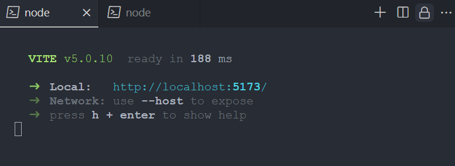
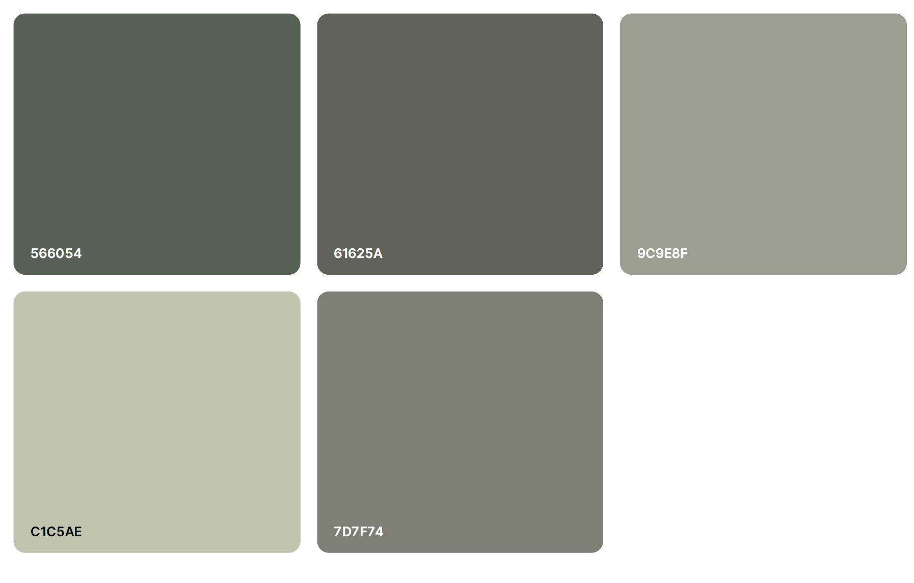
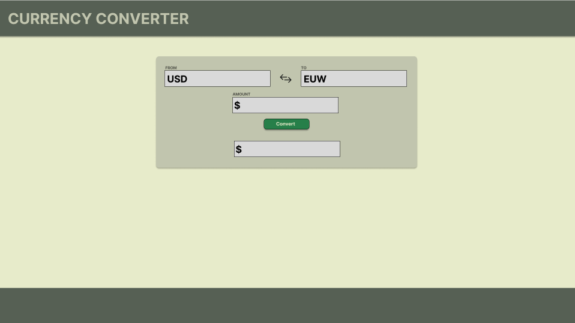
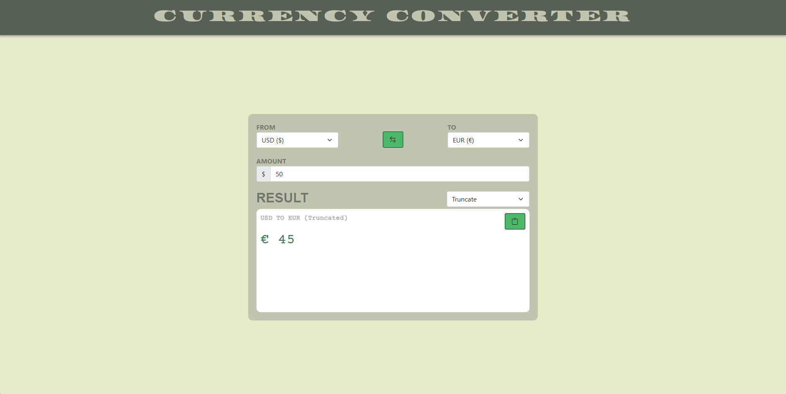
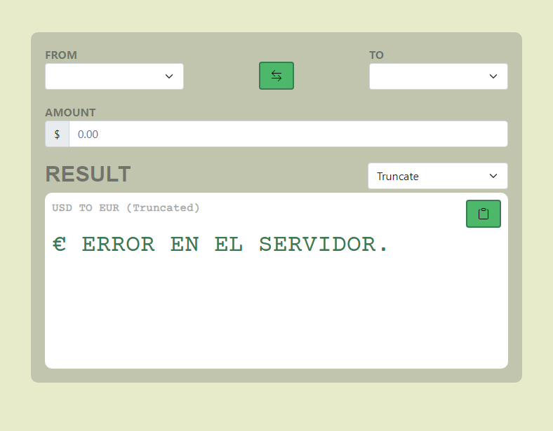
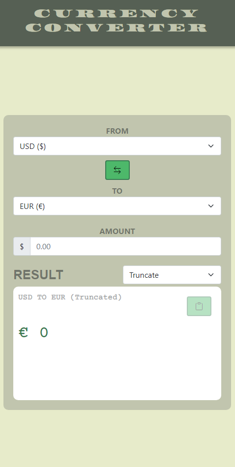

<a name="readme-top"></a>

<!-- PROJECT LOGO -->
<br />
<div align="center">
  <a href="https://rodolfocuevas.com">
    
  </a>

  <h3 align="center">Currency Converter</h3>

  <p align="center">
    Conversor de divisas extranjeras 
</div>

# Introducción

La creación de esta aplicación para el cambio de divisas surge de la necesidad de contar con información actualizada de manera centralizada. Ante la constante fluctuación de los mercados financieros, resulta fundamental disponer de precios precisos y en tiempo real para realizar conversiones de divisas con confianza.

## Versión en vivo

[Version en vivo](https://currency-converter-blc.pages.dev/)

## Tecnologías

- [![React][React.js]][React-url]
- [![Bootstrap][Bootstrap.com]][Bootstrap-url]

## Acerca

La aplicación se encuentra en inglés, ya que al ser un conversor de divisas está pensado en un público más internacional.

## Versionamientos

Para desarrollo fueron utilizadas las siguientes tecnologías:

- [Nodejs](https://nodejs.org/en) en su versión 20.1.0
- [Boostrap](https://getbootstrap.com/) en su versión 5.3.2
- [Boostrap icons](https://icons.getbootstrap.com/) en su versión 1.11.2
- [React](https://react.dev/) en su versión 18.2

### Instalación Local

_A continuación se presenta las instrucción para correr el software de manera local, seguir los pasos en orden y sin saltarse ninguno_

1. Obtener una Api gratuita en [FreeCurrencyApi](https://freecurrencyapi.com/)
2. Clonar el Repositorio

   ```sh
   git clone https://github.com/rcuevaspantoja/currency-converter.git
   ```

3. Instalar los paquetes necesarios
   ```sh
   npm install
   ```
4. Crear un archivo para colocar la Api. Colocar el archivo en la raíz y con el siguiente nombre `.env.local`

   ```js
   VITE_APIKEY = " Tu Api aquí :-) ";
   ```

5. Ejecutar

    ```sh
    npm run dev
    ```
    _Si la consola se ve así es porque fue todo un éxito. Ahora puedes abrirla en el navegador accediendo la ruta en local o haciendo la combinación de teclas O + Enter._
    


## Uso del Aplicativo

La aplicación es simple e intuitiva de usar, tiene 2 SelectBox los cuales permiten seleccionar la divisa de origen y la de destino, junto con un botón para cambiarlas de orden. Seguido de un Input para colocar la cantidad de la divisa de origen a convertir. Para terminar, apartado de resultado cuenta con un SelectBox que permite modificar el formato de salida de la respueta ya sea: truncando, aproximando o entregando el valor exacto y posee un botón en la esquina derecha para copiar el resultado obtenido en el portapapeles.

## Requerimientos

- [x] Selección de monedas de la Api
- [x] Ingresar cantidad a convertir
- [x] Cálculo de conversión
- [x] Visualización de resultados
- [x] Interfaz Responsiva

## Diseño

### Paleta de colores



### Diseño de concepto en Figma



## Screenshots






## Contacto

[![linkedin][linkedin-shield]][linkedin-url]

Enlace del proyecto - [https://github.com/rcuevaspantoja/currency-converter](https://github.com/rcuevaspantoja/currency-converter)


[linkedin-shield]: https://img.shields.io/badge/-LinkedIn-black.svg?style=for-the-badge&logo=linkedin&colorB=555
[linkedin-url]: https://www.linkedin.com/in/rodolfo-cuevas-pantoja-7407231b5/

[React.js]: https://img.shields.io/badge/React-20232A?style=for-the-badge&logo=react&logoColor=61DAFB
[React-url]: https://reactjs.org/

[Bootstrap.com]: https://img.shields.io/badge/Bootstrap-563D7C?style=for-the-badge&logo=bootstrap&logoColor=white
[Bootstrap-url]: https://getbootstrap.com

